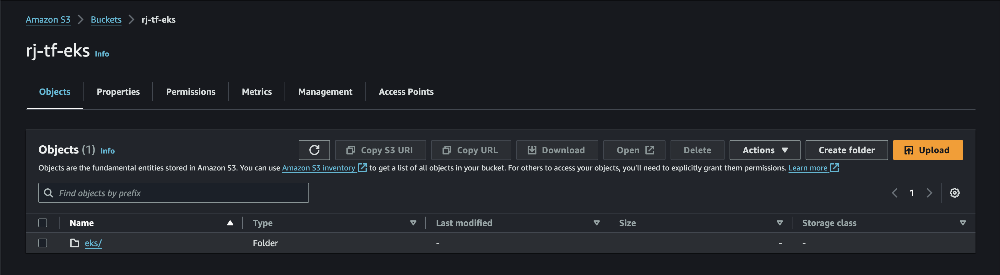
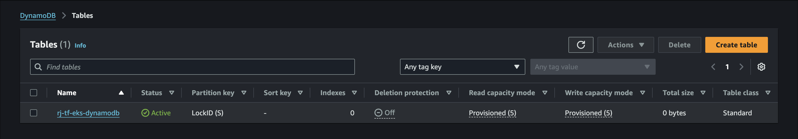

# Configuring EKS Clusters with Terraform

## How To Use

1. Create S3 Bucket



2. Create DynamoDB Table



3. Edit `eks/backend.tf`

```
  backend "s3" {
    bucket         = "rj-tf-eks" # edit this
    region         = "us-east-1" # edit this
    key            = "eks/terraform.tfstate" # edit this
    dynamodb_table = "rj-tf-eks-dynamodb" # edit this
    encrypt        = true
  }
```

4. Ensure to create keypair manually on AWS first
5. Edit `eks/poc.tfvars` According to your environment
   - for eks ami_id, i retrieve from the following link: https://cloud-images.ubuntu.com/docs/aws/eks/
   - for bastion ami, you can use whatever you like

6. Apply Terraform

```
# Configure AWS Creds
aws configure

# Apply Terraform
cd eks
terraform init
terraform validate
terraform plan -var-file=poc.tfvars
terraform apply -var-file=poc.tfvars

# Destroy Terraform
terraform destroy -var-file=poc.tfvars
```

7. Accessing EKS from Bastion

```
# Accessing Bastion
chmod 400 "your-keypair.pem"
ssh -i "your-keypair.pem" ec2-user@<public-ip-or-aws-domain>

# Install kubectl
curl -O https://s3.us-west-2.amazonaws.com/amazon-eks/1.30.4/2024-09-11/bin/linux/amd64/kubectl
curl -O https://s3.us-west-2.amazonaws.com/amazon-eks/1.30.4/2024-09-11/bin/linux/amd64/kubectl.sha256
sha256sum -c kubectl.sha256
chmod +x ./kubectl
mkdir -p $HOME/bin && cp ./kubectl $HOME/bin/kubectl && export PATH=$HOME/bin:$PATH
echo 'export PATH=$HOME/bin:$PATH' >> ~/.bashrc
echo 'alias k=kubectl' >> ~/.bashrc
source ~/.bashrc

# Configure Access to EKS
aws configure

aws eks update-kubeconfig --region us-east-1 --name your-eks-cluster
kubectl config view
kubectl get nodes

# Optional, If you're experiencing issues such as error: exec plugin: invalid apiVersion "client.authentication.k8s.io/v1alpha1", try to upgrade your kubectl or awscli version
```